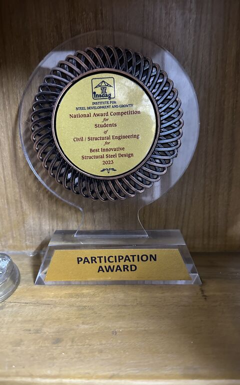
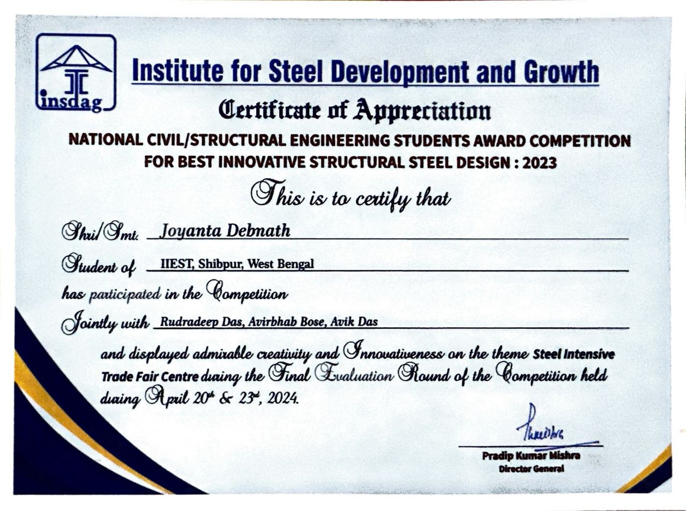

# Awards

Recognition received for academic and engineering work.

---

## INSDAG National Award — Best Innovative Structural Steel Design 2023

**Awarding Body:** Institute for Steel Development and Growth (INSDAG), India  
**Competition:** National Civil / Structural Engineering Students Award Competition  
**Category:** Best Innovative Structural Steel Design — 2023  
**Result:** Participation Award (shortlisted finalist)  
**Team:** Joyanta Debnath, Rudradeep Das, Avirbhab Bose, Avik Das  
**Institution:** IIEST Shibpur, West Bengal  
**Final Evaluation:** April 20 & 23, 2024  
**Theme:** Steel Intensive Trade Fair Centre  
**Signatory:** Pradip Kumar Mishra, Director General, INSDAG

**Description:** Designed an earthquake-resistant and sustainable steel structure as part of a four-member team. The entry was shortlisted for the final evaluation round of INSDAG's National Civil / Structural Engineering Students Award Competition 2023 and was recognized for creativity and innovativeness in structural steel design. The trophy and Certificate of Appreciation were awarded by INSDAG's Director General.

  
  

