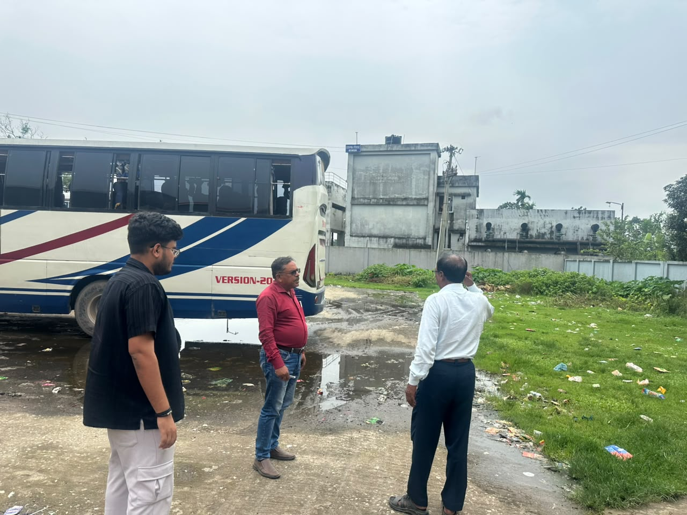
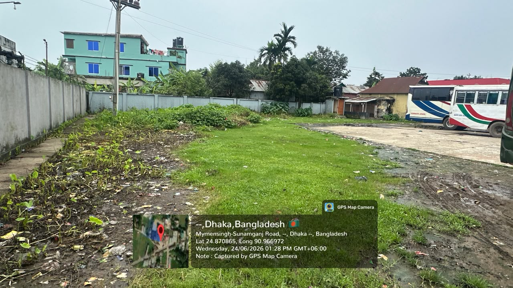
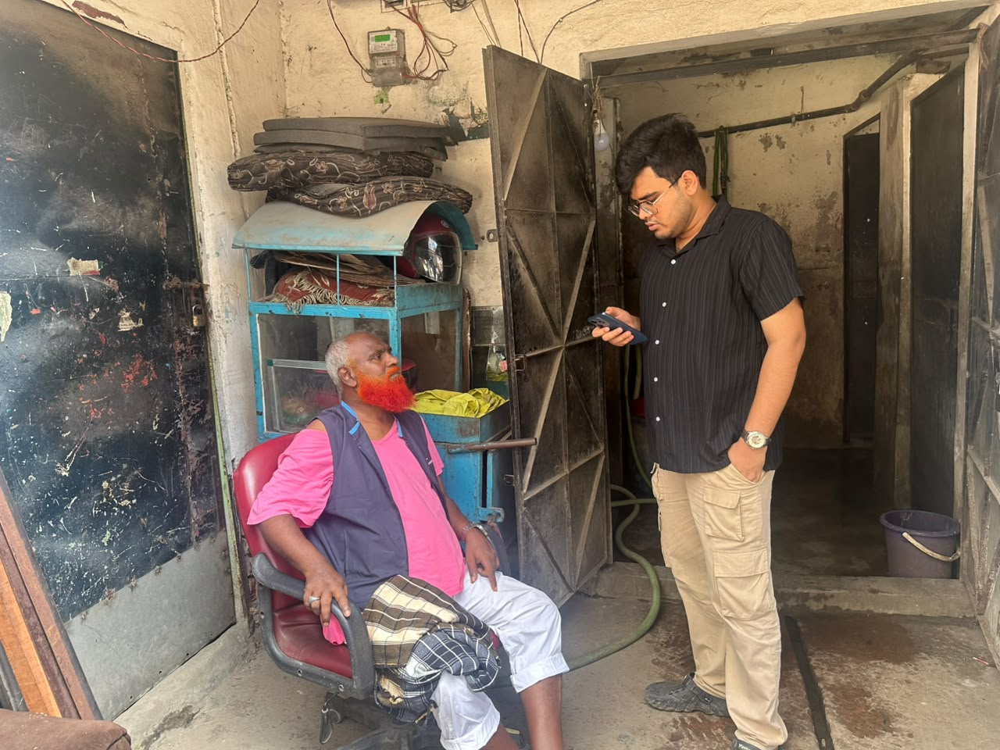
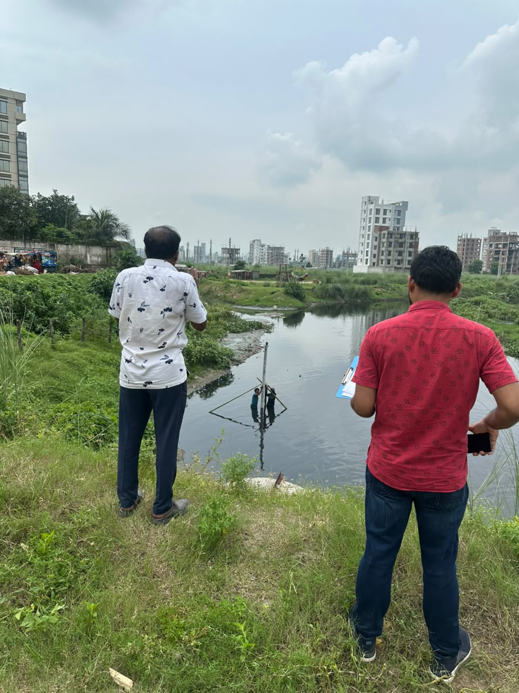
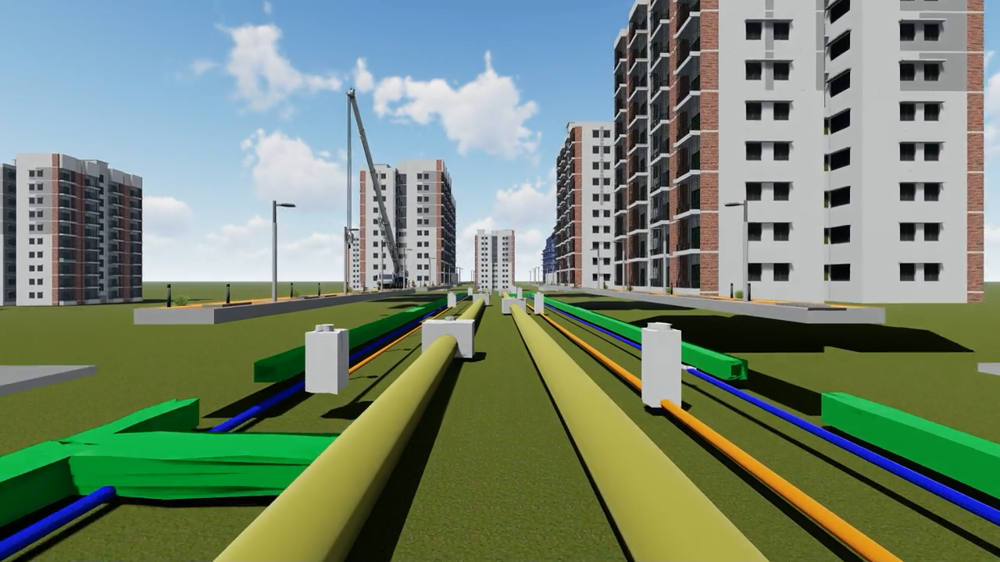
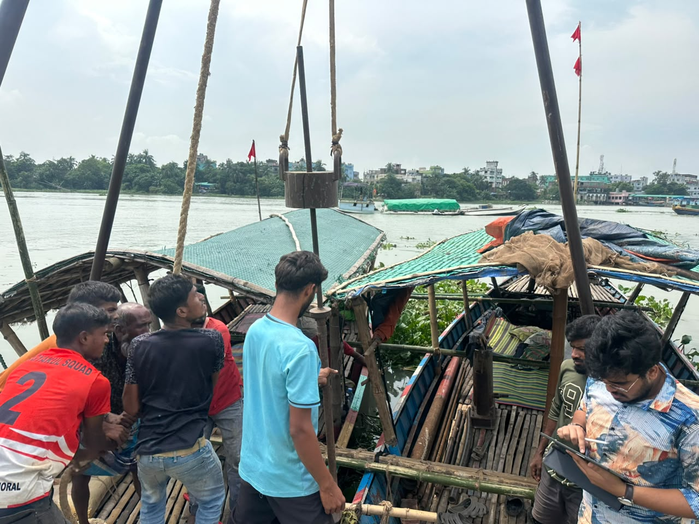
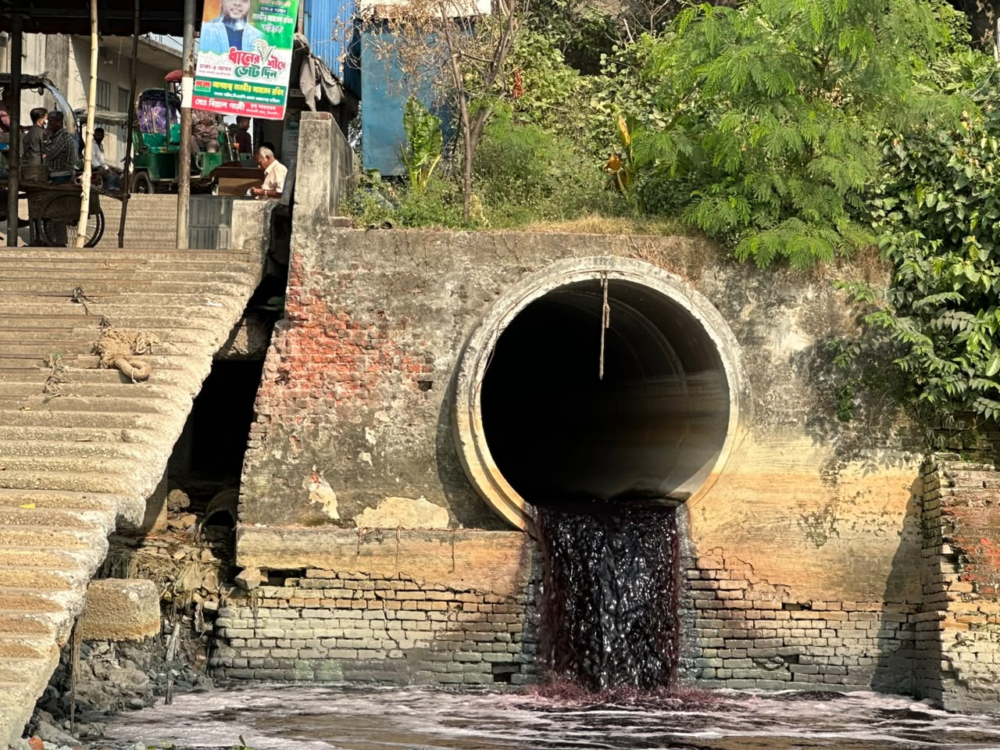
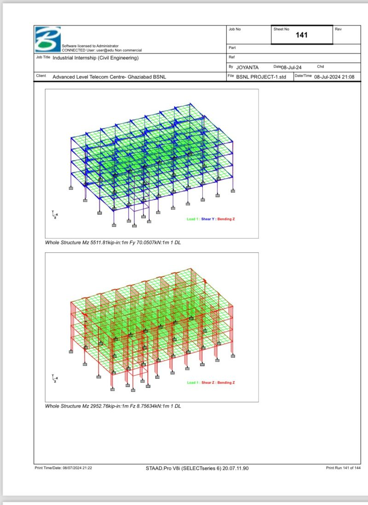
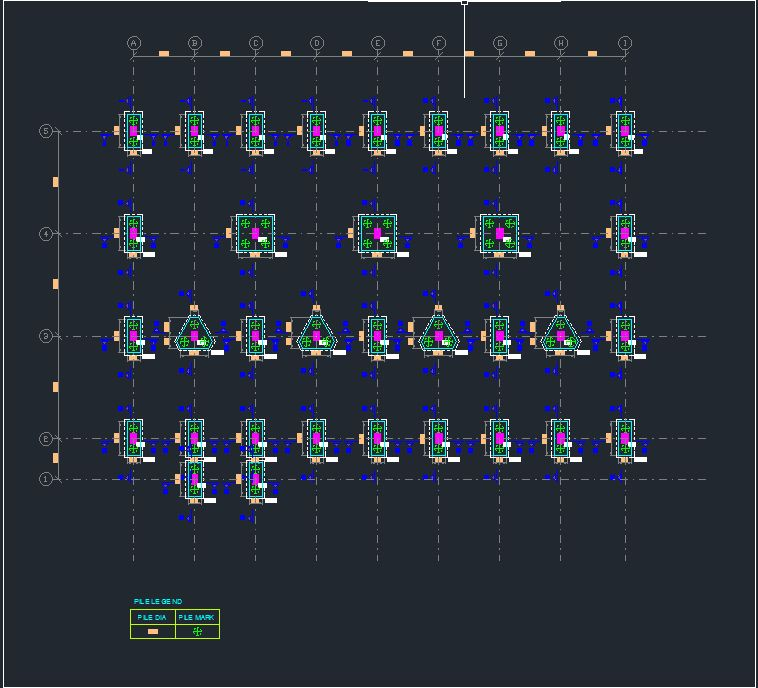

# Projects

A selection of field, design, and research projects from my work at the Institute of Water Modelling (IWM) and academic collaborations.

---

## Urban Climate Resilient Infrastructure Project (UCRIP), Phase-2

**Client:** LGED & KfW  
**Project Leader:** Ahmad Salman Haider, Associate Specialist, WSU Division, IWM  
**Role:** Junior Engineer

**Work methodology:** Conducted municipal field visits across Bangladesh to meet local government officials and assess urban infrastructure and resilience planning. Collected field data on road conditions, community lifestyle, agricultural practices, and land-use issues. Coordinated with municipal officials to document local infrastructure and resilience challenges for incorporation into project recommendations.

  
  

---

## Updating Sewerage Master Plan for Dhaka City

**Client:** UNICEF  
**Project Leader:** Md. Sadbir Rahman, Associate Specialist, WSU Division, IWM  
**Role:** Junior Engineer

**Work methodology:** Executed end-to-end project activities from comprehensive field surveys and data processing to final report submission. Developed thematic maps and geospatial visualizations to support technical analysis of urban sanitation and sewerage planning. Coordinated nighttime fecal sludge management (FSM) operations, overseeing sludge collection from residential areas and ensuring proper transport and testing at the designated Sewage Treatment Plant (STP).

  

---

## Extended Dhaka Water Supply Resilience Project

**Client:** Dhaka WASA (DWASA)  
**Project Leader:** Tanmay Chaki, Director, WSU Division, IWM  
**Role:** Junior Engineer

**Work methodology:** Designed and implemented a custom Database Management System (DBMS) using Python to automate extensive data workflows. Developed Python scripts to clean, standardize, and match complex household data across multiple District Metered Areas (DMAs). Conducted Household Social and Existing Connection Surveys to gather and analyze demographic information, building typologies, and current water connection status for resilience planning.

  
  

---

## Detailed Design, Drawings & BOQ Preparation for Trust Green City Area

**Client:** Army Welfare Trust, Bangladesh Army  
**Project Leader:** Tanmay Chaki, Director, WSU Division, IWM  
**Role:** Junior Engineer

**Work methodology:** Produced detailed 2D engineering drawings for drainage networks, pipe manholes, and utility systems using AutoCAD. Created comprehensive 3D city models and architectural visualizations using SketchUp and Lumion to support integrated utility planning and presentation.

  
  

---

## Feasibility Study: Legacy Pollutant Removal from Buriganga River

**Client:** RID Unit, IWM  
**Supervisor:** Md. Humayun Karim, Survey Specialist, Survey and Data Division, IWM  
**Role:** Junior Engineer

**Work methodology:** Conducted field surveys to collect water samples for environmental quality assessment. Performed riverbed boring from bed level to sand level, collected clay and sand samples, and prepared Bore Log Sheets. Conducted geospatial map building, discharge data collection, and statistical analysis of pollutant data. Also sampled local fish and cultivated vegetables to measure accumulated pollutants, coordinating with BCSIR for laboratory analysis.

  
  
  

---

## Dhaka City Water Supply Improvement Project

**Client:** Dhaka WASA  
**Advisor:** Amit Hassan Shishir, Sewer Network Engineer, WSU Division, IWM  
**Role:** Junior Engineer

**Work methodology:** Developed detailed 2D engineering profiles and drawings using AutoCAD to support technical design and project analysis.

---

## Innovative Steel Structural Design — INSDAG 2023

**Institution:** Institute for Steel Development and Growth (INSDAG), India  
**Supervisor:** Associate Professor Dr. Sujit Kumar Dalui  
**Recognition:** Awarded Best Innovative Structural Steel Design

**Work methodology:** Designed an earthquake-resistant and sustainable structure in a team setting. Developed conceptual, architectural, and structural plans; recognized as one of the Best Innovative Structural Designs of 2023.

---

## Structural Analysis Projects — IIEST Shibpur (Architecture Collaboration)

**Institution:** IIEST Shibpur  
**Year:** May 2025

**Sub-projects:**
- AIFF National Centre of Excellence, New Town, Kolkata — with Indravo Ghosh
- Multipurpose Indoor Sports Complex — with Pranav Vignesh

**Work methodology:** Conducted detailed structural analysis of RCC and steel structures for architectural design submissions using STAAD Pro.

---

## Internship — Advanced Level Telecommunication Training Centre, BSNL

**Location:** Ghaziabad, India  
**Duration:** 6 weeks, June – July 2024  
**Role:** Project Intern (Civil Engineering)

**Work methodology:** Conducted structural analysis of two buildings and foundation design using STAAD Pro. Performed RCC calculations for beams, columns, and slabs; designed architectural layouts and plumbing sections.

  
  

