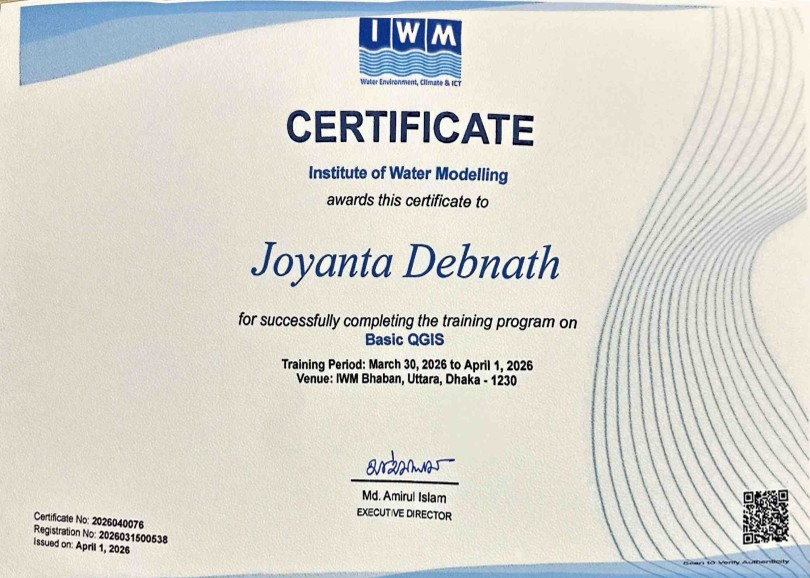
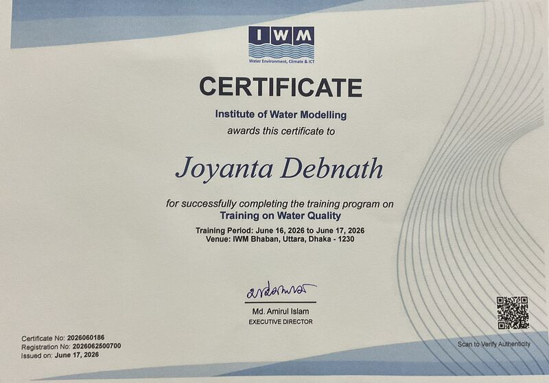
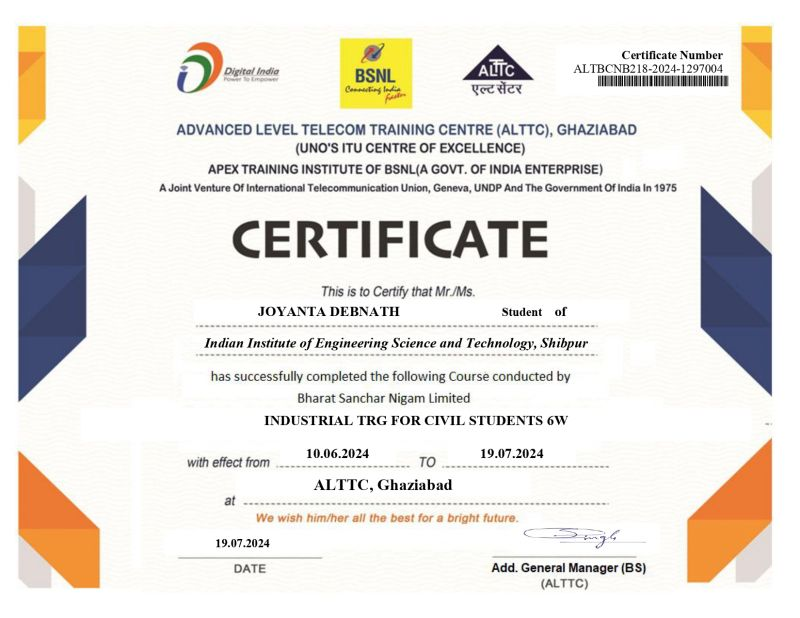

# Training

Professional training programs and structured internship experience that complemented my academic and research work.

---

## Basic QGIS — Institute of Water Modelling (IWM)

**Training Period:** March 30 – April 1, 2026  
**Venue:** IWM Bhaban, Uttara, Dhaka – 1230  
**Certificate No.:** 2026040076  
**Issued:** April 1, 2026  
**Issued by:** Md. Amrul Islam, Executive Director, IWM

**Training summary:** Hands-on training on QGIS fundamentals for water resources applications — data import, coordinate systems, vector and raster processing, thematic map preparation, and geospatial data visualization.

  

---

## Training on Water Quality — Institute of Water Modelling (IWM)

**Training Period:** June 16 – June 17, 2026  
**Venue:** IWM Bhaban, Uttara, Dhaka – 1230  
**Certificate No.:** 2026060196  
**Issued:** June 17, 2026  
**Issued by:** Md. Amrul Islam, Executive Director, IWM

**Training summary:** Focused training on water quality assessment — sampling protocols, physicochemical and biological parameter analysis, comparison against WHO, EPA, ECR, and IS standards, and interpretation of water quality data for sustainable resource management.

  

---

## Industrial Training for Civil Students — ALTTC, BSNL Ghaziabad

**Training Centre:** Advanced Level Telecom Training Centre (ALTTC), Ghaziabad  
**Organisation:** Bharat Sanchar Nigam Limited (BSNL) — A Govt. of India Enterprise  
**Course:** Industrial Training for Civil Students (6 Weeks)  
**Duration:** 10 June 2024 – 19 July 2024  
**Certificate No.:** ALTBCNB218-2024-1297004  
**Issued:** 19 July 2024  
**Signatory:** Addl. General Manager (BS), ALTTC

**Work performed:**
- Structural analysis of two buildings and foundation design using STAAD Pro
- RCC calculations for beams, columns, and slabs
- Architectural layout design and plumbing section preparation

  
  
  

